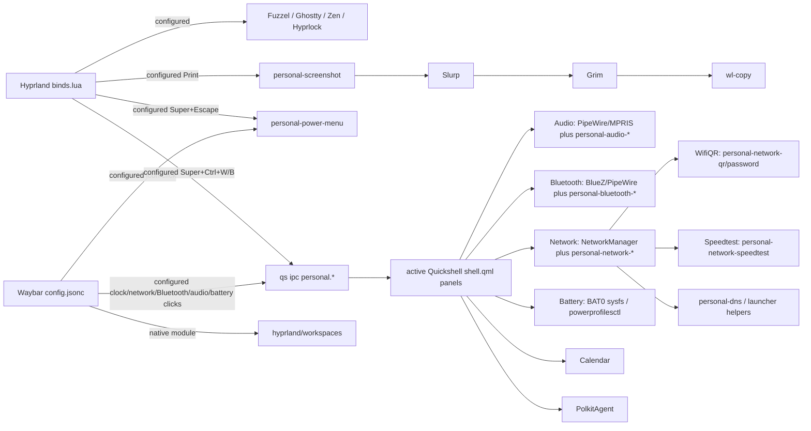

# Observed dependency and lifecycle graph

Edges marked **observed** have live process, service, journal, or IPC evidence. **Configured** edges appear in active entry files but the specific action was not triggered. **Broken/uncertain** edges have conflicting evidence or missing dependencies. No command in these diagrams was executed to exercise a UI action.

## Login to desktop

```mermaid
flowchart TD
  A[systemd graphical target] -->|observed enabled and running| B[sddm.service]
  B -->|observed sddm-autologin| C[sddm-helper]
  C -->|observed Wayland session desktop file| D[/usr/bin/start-hyprland]
  D -->|observed child| E[Hyprland]
  E -->|Lua entry inferred; runtime Lua binds observed| F[~/.config/hypr/hyprland.lua]
  F -->|requires modules| G[config/autostart.lua]
  G -->|observed child| H[awww-daemon]
  G -->|observed child| I[swayosd-server]
  G -->|observed child| J[personal-kbd-osd-daemon]
  G -->|observed child| K[waybar]
  G -->|observed child| L[qs -p ~/.config/quickshell/personal]
  G -->|configured one shot| M[personal-wallpaper]
  G -->|configured| N[dbus-update-activation-environment]
  O[systemd user manager] --> P[PipeWire / Pulse / WirePlumber]
  O --> Q[DBus / portals / keyring]
  R[systemd system manager] -->|observed enabled active| S[personal-audio-router.service]
  S --> T[/usr/local/bin/personal-audio-router]
```

`~/.config/hypr/hyprland.lua` requires, in order: `animations` → `autostart` → `colors` → `decorations` → `variables` → `environment` → `inputs` → `binds` → `misc` → `monitors` → `windowrules` → `layers` → `workspaces`. This is module evaluation order, not a claim that each setting's effect was individually exercised. `colors.lua` feeds `decorations.lua` and `misc.lua`; `variables.lua` feeds `workspaces.lua`.

SDDM's Astronaut `theme.conf` edge ends at a selection file. The live autologin path supplies no theme rendering proof. Greetd is installed but disabled/inactive. The current boot journal confirms `/usr/share/wayland-sessions/hyprland.desktop`; the alternate `hyprland-uwsm.desktop` is present but not selected. Waybar's user unit is disabled/inactive and its live process is a Hyprland child.

## UI and action graph



The live Quickshell root instantiates a transparent bottom-layer host and popup panels. Its `TopBar.qml` and `WorkspaceIndicator.qml` are **not** instantiated by `shell.qml`; the live Waybar module still renders workspaces. `Ui/Panel.qml` supplies common IPC handlers and popup control. `panels/network/Panel.qml` owns its own `personal.network` IPC handler. Network invokes native NetworkManager plus helpers; Audio uses PipeWire/MPRIS plus `wpctl`/`pactl` scripts; Bluetooth uses BlueZ and the same audio stack. WifiQR reads credentials through NetworkManager; never archive its output.

`qs.Commons.Color` is used by active panels and tries `~/.local/state/omarchy/current/theme/{colors,shell}.toml` plus `~/.config/omarchy/shell.toml`; none of these paths exist. Its QML fallback colors are consequently the likely current source for those widgets. This is separate from Matugen's palette JSON, whose explicit Quickshell consumers are currently uninstantiated components.

The root Polkit agent is instantiated, but its QML references missing `personal-hw-laptop-closed`. The terminal and browser network helpers reference old Omarchy/UWSM paths or missing commands. Those edges are broken/uncertain until exercised safely in a later phase. No separate notification, idle, clipboard history, or recording daemon was found running during the snapshot; on-demand Fuzzel, Hyprlock, screenshot and power menu actions are configured but not runtime verified.

## Wallpaper and theme graph

```mermaid
flowchart TD
  A[Hyprland autostart.lua] -->|observed process| D[awww-daemon]
  A -->|configured one shot; outputs timestamped| W[personal-wallpaper]
  W -->|reads; matches live image| SF[~/.local/state/personal-wallpaper/current]
  W -->|waits for socket| D
  W -->|configured matugen image| M[Matugen]
  M -->|configured wallpaper hook| D
  M -->|template| WC[Waybar colors.css]
  WC -->|CSS import| WB[Waybar style.css]
  M -->|template| GT[Ghostty themes/personal]
  GT -->|theme setting| GC[Ghostty config]
  M -->|template| PJ[generated palette.json]
  PJ -->|configured hook| TA[personal-theme-apply]
  TA -->|configured keyword writes; absent in current runtime| HC[Hyprland border colors and size]
  M -->|configured SIGUSR2| WB
  M -->|configured SIGUSR1| GC
  W -->|duplicate configured call| TA
  W -->|duplicate configured SIGUSR2| WB
  D -->|observed current image| LIVE[/home/snehil/Downloads/onePiece.png]
```

`personal-wallpaper`'s direct `awww img` line is commented. Matugen config is the configured wallpaper-setting arrow. The current awww image matches the saved selection; generated palette/Waybar/Ghostty files were written near session start. Ghostty and Waybar signal hooks are configured; visible reload was not tested. Hyprland's queried colors and border size are the static Lua values, proving the current dynamic border effect is absent. `TopBar.qml` and `WorkspaceIndicator.qml` contain palette `FileView` consumers, but since neither is instantiated by the active root they do not establish current Quickshell palette use.

## System feature graph

`personal-audio-router.service` (system unit, active as root) → `/usr/local/bin/personal-audio-router` → `runuser -u snehil`/`pactl` → hardcoded internal ALSA sink; in parallel it watches an `HDA Intel PCH Headphone Mic` input event via `evtest` and a Pulse subscription for Bluetooth sink events. Routing decisions are coded; a physical plug/unplug or Bluetooth handoff was not tested. This is distinct from Quickshell's audio panel scripts.

`personal-kbd-osd-daemon` (Hyprland child) → `/sys/class/leds/dell::kbd_backlight/brightness` via Python `POLLPRI` → `swayosd-client`. The active daemon establishes startup, but no brightness event was generated. SwayOSD also receives media/brightness commands from Hyprland binds when those keys are pressed.
